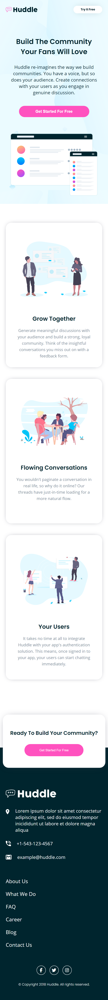

# Frontend Mentor - Huddle landing page with alternating feature blocks
This is a solution to the "Huddle landing page with alternating feature blocks" challenge on [Frontend Mentor](https://www.frontendmentor.io/challenges/huddle-landing-page-with-alternating-feature-blocks-5ca5f5981e82137ec91a5100).

## The challenge
Your challenge is to build out this landing page and get it looking as close to the design as possible.

You can use any tools you like to help you complete the challenge. So if you've got something you'd like to practice, feel free to give it a go.

Your users should be able to:

- View the optimal layout for the interface depending on their device's screen size
- See hover and focus states for all interactive elements on the page
## Screenshots
#### 1440px

#### 375px

## 🔗 Links
- Solution URL: [click here](https://www.frontendmentor.io/solutions/huddle-landing-page-with-alternating-feature-blocks-JPOkEeogOJ)
- Live URL: [click here](https://mateuszhofman.github.io/Huddle-landing-page-github.io/)
## Author

- Frontend Mentor: [@mateuszhofman](https://www.frontendmentor.io/profile/mateuszhofman)
- Linkedin: [@mateusz-hofman](https://www.linkedin.com/in/mateusz-hofman-b815502a8/)

